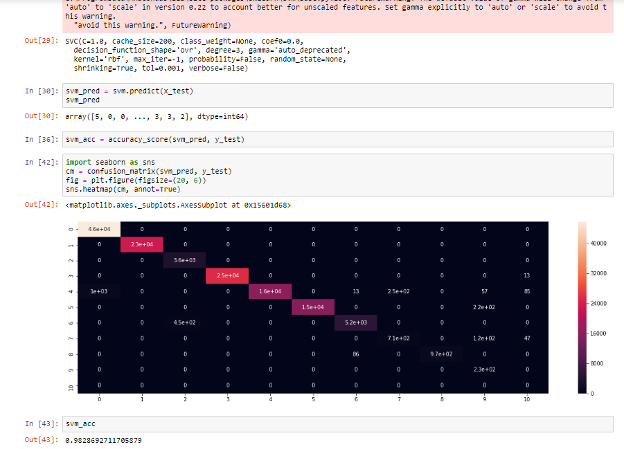
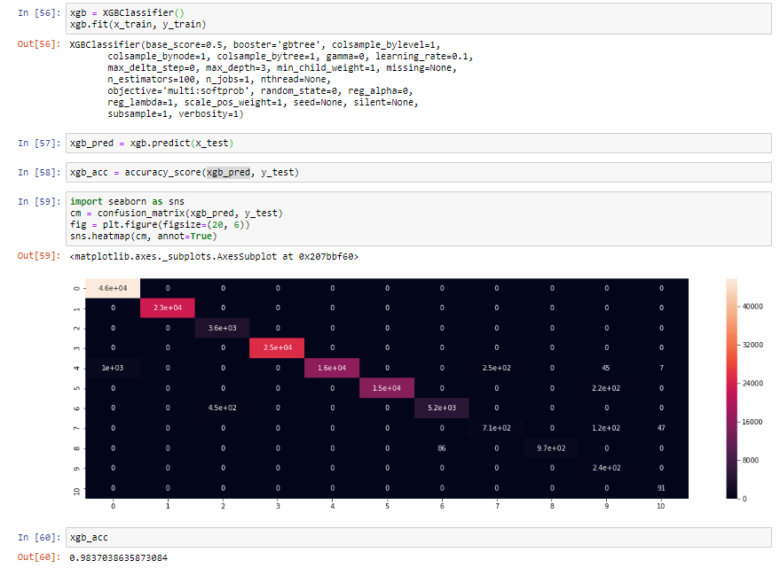

# Customer_Complaint_Resolution

Customer resolutions is very important subject for any organisation. Customer satisfaction has impact on organisation's profit as well as reputation. In this project i will approach 2 methods for sloving this problem by using robust Machine Learning Models like Random Forest Model (RF) and Xtra Gradient Boosting Model (XGB).  

In the first method i will choose only 2 columns and convert custome complaint resolution problem in to Auto tagging problem. As we did in StackOverflow tag prediction project. But, here we will use Machine Learning Algorithms instead of Deep Learning. 

In the second method i will do the problem in hard approach (by using tfidi vectorizer, making more features from text etc.,) to predict the future customer resolutions based on there issues, products etc.

### Libraries Used

import pandas as pd  
import numpy as np  
from textblob import TextBlob, Word  
from nltk.stem import SnowballStemmer, WordNetLemmatizer  
from nltk.corpus import stopwords  
from sklearn.feature_extraction.text import TfidfVectorizer  
import matplotlib.pyplot as plt  
from sklearn.model_selection import train_test_split  
from sklearn.metrics import accuracy_score, confusion_matrix  
from sklearn.linear_model import LogisticRegression  
from sklearn.naive_bayes import MultinomialNB  
from sklearn.ensemble import RandomForestClassifier  
from sklearn.svm import SVC  
import xgboost  
from xgboost import XGBClassifier

***DATA***

__**Column names**__ = ['date_received', 'product', 'sub_product', 'issue', 'sub_issue',
       'consumer_complaint_narrative', 'company_public_response',
       'company', 'state', 'zipcode', 'tags', 'consumer_consent_provided',
       'submitted_via', 'date_sent_to_company',
       'company_response_to_consumer', 'timely_response',
       'consumer_disputed?', 'complaint_id']
       
data shape = (555957, 7)

__**METHOD 1**__

Most repeated tag in the data is Mortrage.

___***Text Cleaning***___

**Logistic Regression Model**

**Navie Bayes Model**

**Support Vector Machine Model**

***Random Forest Model***

**Xtra Gradient Boosting Model**

**Better Accuracy**

Performance of  __***XGB***__ is better than other models. Using RamdomSearchCv will make model more generalise and give overall better efficiency.

__**METHOD 2**__

__***Text Cleaning***__

__***TFIDF Vectorizer***___

**Final Accuracy**

In both the methods __***XGB***__ performs slightly better than __***RF***__. But using RandomSearchCv could make the game changer.
